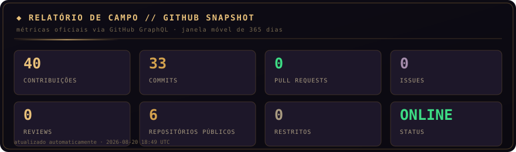
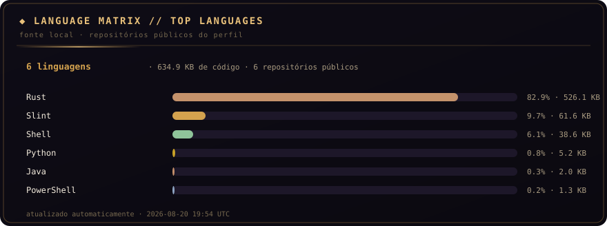
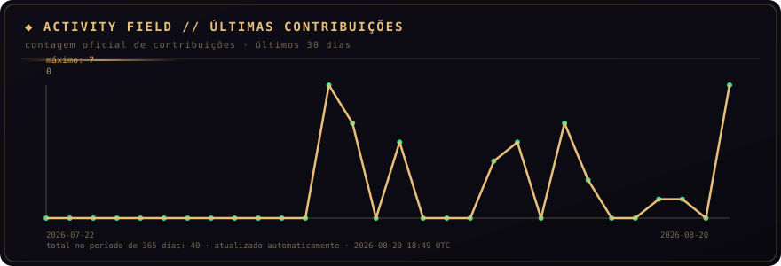

# Danilo Jesus

  

  

  

## Sobre mim

Olá! Eu sou **Danilo Jesus**, estudante e desenvolvedor em formação. Este perfil reúne meus projetos, estudos e experimentos de programação.

Estou aprendendo e construindo projetos com foco em **desenvolvimento de software**, boas práticas e evolução contínua. Esta seção pode ser editada livremente para refletir meus interesses atuais.

## Tecnologias e interesses

| Área | Descrição |
| :--- | :--- |
| Desenvolvimento | Adicione aqui as tecnologias que você utiliza. |
| Estudos atuais | Adicione aqui o que está aprendendo. |
| Projetos | Adicione aqui os projetos dos quais mais se orgulha. |
| Contato | Adicione aqui seus links profissionais ou redes sociais. |

## Como este painel funciona

Os cartões são gerados pelo script [`profile_update.py`](./.github/scripts/profile_update.py), que consulta as métricas públicas do próprio GitHub e grava SVGs dentro da pasta `assets/`. O workflow [`profile-update.yml`](./.github/workflows/profile-update.yml) roda uma vez por semana e cria um commit **somente quando os dados realmente mudam**.

> O projeto não monitora outros repositórios, não transforma cada atividade em um commit e não depende de serviços externos de cartões. Ele foi pensado para um perfil pessoal normal, com manutenção baixa e histórico limpo.

## Personalização e prompts

O arquivo [`docs/AI-PROMPTS.md`](./docs/AI-PROMPTS.md) contém os prompts prontos para personalizar o perfil, alterar o visual, adicionar métricas e corrigir problemas. O guia [`docs/SETUP.md`](./docs/SETUP.md) explica a configuração, os testes locais e a ativação do workflow.

## Contato

- GitHub: [danilo-jesus-unifil](https://github.com/danilo-jesus-unifil)
